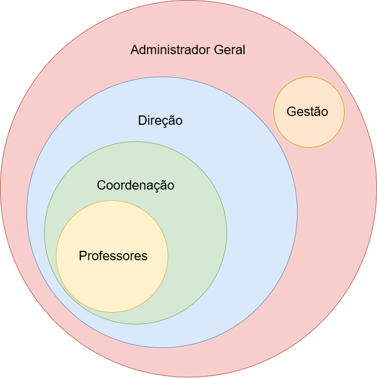
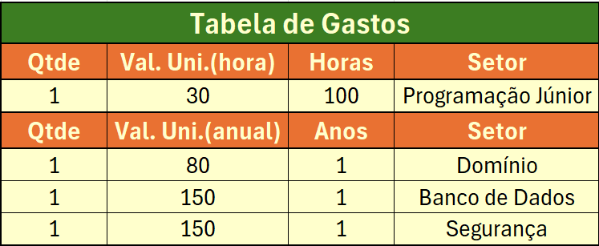
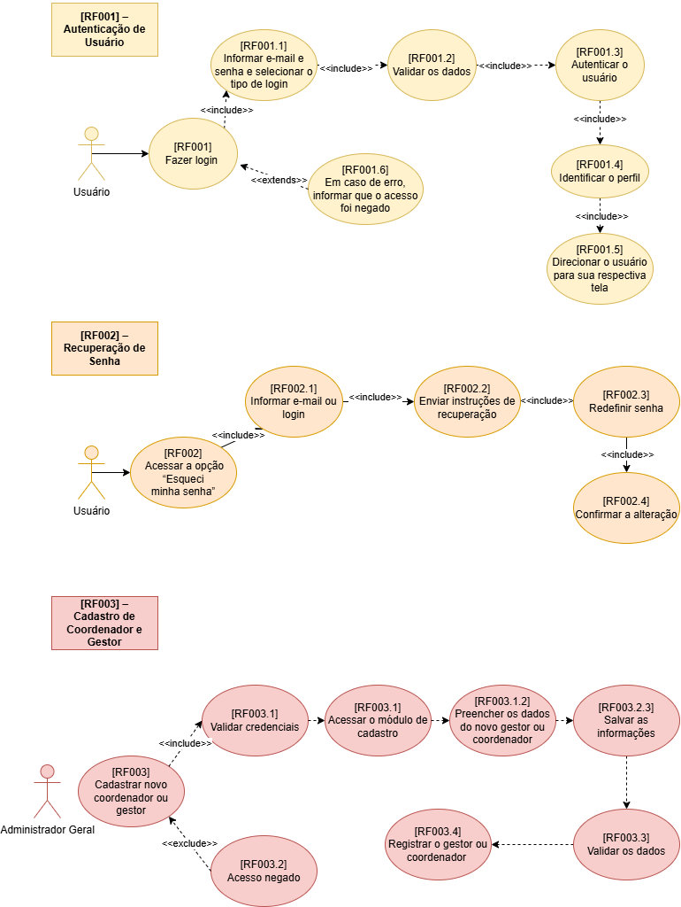
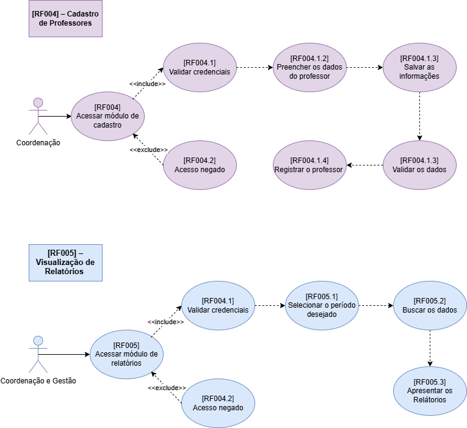
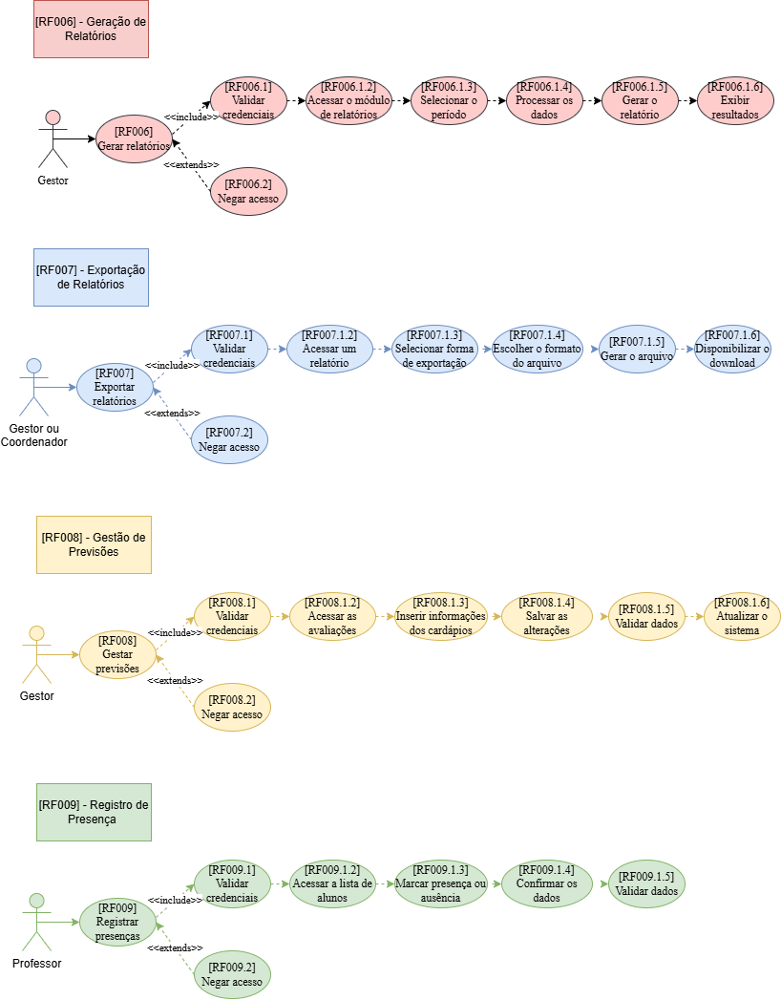
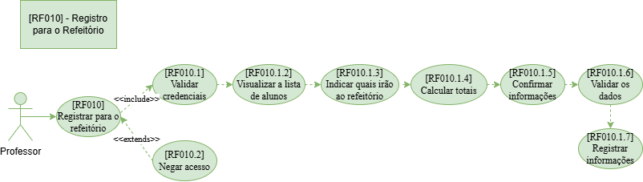

# PROJETO - GESTÃO DO REFEITÓRIO

## Introdução
    Nosso projeto tem como objetivo melhorar a gestão alimentar nas escolas do SESI, trazendo mais transparência sobre o desperdício de alimentos e o comportamento dos alunos em relação às refeições. A proposta é utilizar um sistema no qual os estudantes possam avaliar diariamente o que é servido, informando se gostaram, não gostaram ou não consumiram, além de indicar os motivos, enquanto o sistema também registra a quantidade de comida descartada. Paralelamente, os gestores terão um sistema interno próprio para realizar o controle dessas informações, acompanhando dados, relatórios e indicadores de forma organizada. Com isso, passam a ter uma visão concreta da aceitação dos pratos e do impacto do desperdício, permitindo ajustes mais estratégicos no cardápio, redução de custos e melhor uso dos recursos. Dessa forma, além de diminuir o desperdício, o projeto contribui para aumentar a adesão às refeições, melhorar a alimentação dos alunos e possibilitar que a economia gerada seja investida em outras melhorias dentro da escola.

| PARTICIPANTES:                      |
|:-----------------------------------:|
| -João Victor Moraes Lopes; (Líder)  |
| -Jéssica Guedes Vaz;                |
| -Lívia Fernandes de Morais;         |
| -Leonardo Canina Marchiori;         |
| -Eloísa Macedo da Silva.            |

# Funcionamento

  No sistema, os professores irão inserir os dados da quantidade de alunos que irão comer de acordo com a sala em que eles vão dar a primeira aula, os dados serão enviados automaticamente, ao entrar, há a verificação das credenciais dos gestores, da coordenação e dos professores
  
# PLANILHA - Gastos Estimados do Projeto

# Diagramas de Caso de Uso (DCU)

